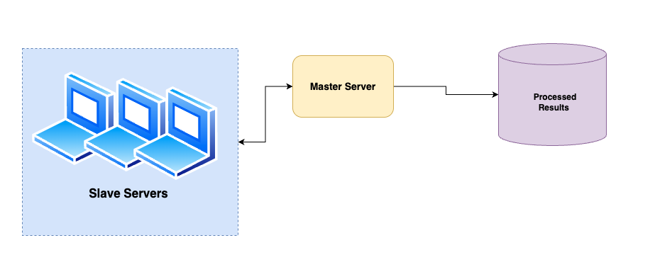

# Master-Slave Distributed Processing Service

This repository contains a master-slave architecture for distributed multi-type file processing using Flask and HTTP. The system supports 6 different processing types: image processing, text analysis, embedding generation, OCR, audio analysis, and document processing. The master receives files, distributes them to registered slaves based on processing type, and collects the processed results.

<div align="center">
  
  <p><em>System Architecture Overview - Master-Slave Distributed Processing Service with Multi-Type File Processing</em></p>
</div>

## Project Structure

```
os-project/
├── master.py                           # Main entry point for master server
├── slave.py                            # Main entry point for slave server with auto-registration
├── client.py                           # Testing client for API endpoints
├── .env.example                        # Environment configuration template
├── master_service/                     # Master server application package
│   ├── __init__.py                    # Package initialization
│   ├── app.py                         # Flask application factory and configuration
│   ├── routes.py                      # API endpoint handlers and task routing logic
│   └── worker.py                      # Slave management and task distribution system
├── slave_service/                      # Slave server application package
│   ├── __init__.py                    # Package initialization  
│   ├── app.py                         # Flask application factory with registration
│   ├── routes.py                      # Multi-type processing endpoint handlers
│   ├── processing.py                  # Image processing and grayscale conversion
│   ├── text_processing.py             # Text analysis, sentiment, and statistics
│   ├── embedding_processing.py        # TF-IDF vector embedding generation
│   ├── ocr_processing.py              # Optical Character Recognition engine
│   ├── audio_processing.py            # WAV audio file analysis and features
│   └── document_processing.py         # PDF and DOCX text extraction
└── processed_results/                  # Output directory for processed files
    ├── image/                         # Grayscale converted images
    ├── text/                          # Text analysis results
    ├── embedding/                     # Generated vector embeddings
    ├── ocr/                           # Extracted text from images
    ├── audio/                         # Audio analysis data
    └── document/                      # Document processing results
```

### File Descriptions

**Core Application Files:**
- **`master.py`** - Lightweight launcher that initializes the master Flask application using the master_service package
- **`slave.py`** - Lightweight launcher that initializes the slave Flask application and handles automatic registration with master
- **`client.py`** - Command-line testing utility for sending files to master and testing different processing types

**Master Service Package:**
- **`app.py`** - Flask application factory with configuration management and middleware setup
- **`routes.py`** - HTTP endpoint handlers for task assignment, slave registration, and status checking
- **`worker.py`** - Core business logic for slave registry management, task distribution, and result collection

**Slave Service Package:**
- **`app.py`** - Flask application factory with automatic master registration and health monitoring
- **`routes.py`** - HTTP endpoint handlers for receiving and processing multi-type tasks from master
- **`processing.py`** - Image processing module for grayscale conversion and format handling
- **`text_processing.py`** - Natural language processing for sentiment analysis, word statistics, and keyword extraction
- **`embedding_processing.py`** - Machine learning module for TF-IDF vectorization and feature extraction
- **`ocr_processing.py`** - Optical Character Recognition engine for text extraction from images
- **`audio_processing.py`** - Audio signal processing for WAV file analysis and feature computation
- **`document_processing.py`** - Document parser for PDF and DOCX text extraction and metadata analysis

**Output Structure:**
- **`processed_results/`** - Organized storage directory where the master saves all processed files, categorized by processing type for easy retrieval and management

## Requirements

- Python 3.8+
- pip

### Core Dependencies
```powershell
python -m pip install Flask requests Pillow python-dotenv
```

### Processing-Specific Dependencies
```powershell
# For OCR processing
python -m pip install pytesseract

# For text analysis and embeddings
python -m pip install scikit-learn nltk

# For audio processing
python -m pip install numpy

# For document processing
python -m pip install PyPDF2 python-docx

# For testing (optional)
python -m pip install pytest pytest-cov
```

### Install All Dependencies
```powershell
python -m pip install Flask requests Pillow python-dotenv pytesseract scikit-learn nltk numpy PyPDF2 python-docx pytest pytest-cov
```

## Configuration

Environment variables (optional):

- For the slave (via `.env` or system environment):
  - `MASTER_URL` - URL of the master server (default: `http://localhost:5000`)
  - `SLAVE_IP` - IP address the slave should advertise (default: resolved via socket)
  - `SLAVE_PORT` - Port the slave Flask app will run on (default: `3000`)

## How it works (high-level)

1. Start the master:
   - `python master.py`
   - Master listens on port 5000 and exposes `/register`, `/assign_task`, and `/check_status`.
2. Start one or more slaves:
   - Optionally create a `.env` with `MASTER_URL`, `SLAVE_PORT`, etc.
   - `python slave.py`
   - On startup, the slave attempts to register with the master by POSTing to `/register`.
3. Submit files to the master for processing:
   - The master accepts multipart/form-data POST to `/assign_task` with `task_type` parameter and appropriate file field.
   - Examples using `curl`:

```powershell
# Image processing (grayscale conversion)
curl -X POST "http://localhost:5000/assign_task" -F "task_type=image" -F "images=@C:\path\to\photo.jpg"

# Text analysis
curl -X POST "http://localhost:5000/assign_task" -F "task_type=text" -F "texts=@C:\path\to\document.txt"

# OCR processing
curl -X POST "http://localhost:5000/assign_task" -F "task_type=ocr" -F "images=@C:\path\to\scanned.png"

# Audio analysis
curl -X POST "http://localhost:5000/assign_task" -F "task_type=audio" -F "audio_files=@C:\path\to\audio.wav"

# Document processing
curl -X POST "http://localhost:5000/assign_task" -F "task_type=document" -F "documents=@C:\path\to\report.pdf"
```

4. The master distributes the files evenly among registered slaves based on processing type, waits for results, and saves processed data in `processed_results/<task_type>/`. The `/assign_task` response includes a JSON summary with file paths and processing statistics.

## API Endpoints

### Master (`master.py`):
- `GET /` - Health check. Returns "Master is working".
- `POST /register` - Slaves register themselves. Expects JSON: `{ "slave_ip": "<ip>", "slave_port": <port> }`.
- `POST /assign_task` - Accepts `multipart/form-data` with `task_type` and appropriate files. Distributes tasks and returns processed file paths.

### Slave (`slave.py`):
- `GET /` - Health check. Returns "Slave is working".
- `POST /get_task` - Receives files and `task_type`, processes them based on type, returns JSON with Base64-encoded results.
- `GET /check_status` - Returns `{ "status": "alive" }`.

### Processing Types Supported:

| Task Type | File Field | Input Formats | Output |
|-----------|------------|---------------|--------|
| `image` | `images` | JPG, PNG, etc. | Grayscale images |
| `text` | `texts` | TXT, any text | Sentiment analysis, statistics |
| `embedding` | `texts` | TXT, any text | TF-IDF vector embeddings |
| `ocr` | `images` | JPG, PNG, etc. | Extracted text from images |
| `audio` | `audio_files` | WAV | Audio features (duration, RMS, etc.) |
| `document` | `documents` | PDF, DOCX, TXT | Text extraction, metadata |

## Example usage (Python client)

Here's a minimal example of sending images to the master from Python:

```python
import requests

files = [
    ("images", open("image1.png", "rb")),
    ("images", open("image2.jpg", "rb")),
]
resp = requests.post("http://localhost:5000/assign_task", files=files)
print(resp.json())
```

You can also use the built-in demo client `client.py` for different processing types:

```powershell
# Image processing
python client.py http://localhost:5000 image C:\path\to\photo1.jpg C:\path\to\photo2.png

# Text analysis
python client.py http://localhost:5000 text C:\path\to\document.txt C:\path\to\essay.txt

# OCR processing
python client.py http://localhost:5000 ocr C:\path\to\scanned_doc.png

# Audio processing
python client.py http://localhost:5000 audio C:\path\to\song.wav

# Document processing
python client.py http://localhost:5000 document C:\path\to\report.pdf C:\path\to\presentation.docx

# Embedding generation
python client.py http://localhost:5000 embedding C:\path\to\text1.txt C:\path\to\text2.txt
```

Set up a `.env` for a slave by copying `.env.example` to `.env` and editing values as needed.

## Troubleshooting

- If slaves fail to register:
  - Ensure `MASTER_URL` is correct and reachable from the slave host.
  - Check that the master is running on the host and port specified.
  - If using Docker or multiple machines, verify networking and firewall settings.

- If `/assign_task` responds with "No slaves available":
  - Ensure at least one slave is running and successfully registered.
  - Check master logs for registration events.

- Large files/timeouts:
  - The master sets a 45-second timeout per slave request; adjust this in `master.py` if needed.

## Processing Capabilities

### 1. Image Processing
- **Input:** JPG, PNG, BMP, etc.
- **Processing:** Grayscale conversion
- **Output:** PNG files with processed images

### 2. Text Analysis  
- **Input:** Text files (.txt)
- **Processing:** Word count, sentiment analysis, keyword extraction
- **Output:** JSON with statistics and sentiment scores

### 3. Embedding Generation
- **Input:** Text files (.txt)  
- **Processing:** TF-IDF vectorization
- **Output:** JSON with vector embeddings and features

### 4. OCR Processing
- **Input:** Image files (JPG, PNG, etc.)
- **Processing:** Optical Character Recognition
- **Output:** JSON with extracted text and confidence scores

### 5. Audio Analysis
- **Input:** WAV audio files
- **Processing:** Duration, RMS energy, zero-crossings analysis  
- **Output:** JSON with audio features and metadata

### 6. Document Processing
- **Input:** PDF, DOCX, text files
- **Processing:** Text extraction, metadata analysis
- **Output:** JSON with extracted content and document structure

## Next steps / Improvements

- Add retries and re-assignment for failed slave tasks.
- Add authentication between master and slaves.
- Implement advanced ML models for each processing type.
- Add real-time processing and WebSocket support.
- Create web UI for file uploads and result visualization.
- Add comprehensive unit tests and CI/CD pipeline.

## License

This project is provided as-is for educational/demo purposes.
